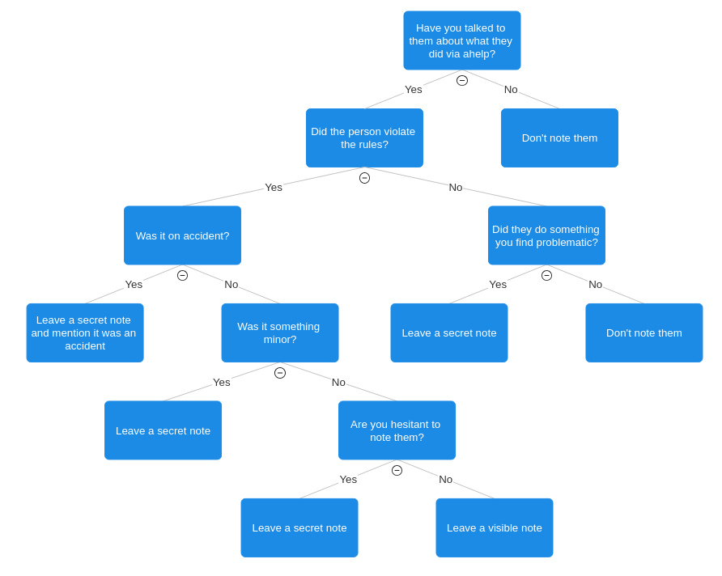

(currently a proposal)
# New Admin Noting Policy
## Preface
A traditional noting/strike policy is insufficient for Moffstation due to a couple of factors:
- In a small community like Moffstation, Admins are afraid to leave notes because they are seen as punishment by players, which may end up effecting their reputation.
- A strike system is better suited for large servers where it is harder to track specific players on an individual basis.

This details a system of using notes as admin notekeeping rather than as strike system, which entails creating them far more frequently. This method will leverage our small population and our ability to track players on an individual basis, which will improve our ability to handle punishments greatly.

## Policy
We want admins to leave notes **frequently** in order to establish patterns of behavior, as well as to have receipts when we decide to warn people or hand out punishments.

### When Should I Leave Notes? Should I Note X?
If it was something worth ahelping, then the answer is usually to leave a note; but you can use the flowchart below if you're uncertain. Even If it's something minor, secret note them. This methodology of adminning relies upon having a good paper trail for other admins to pick up on so that we can establish patterns, so its important you don't sweep things under the rug even if they're small.



### How Should I Format My Notes?
Its important to include details in your notes, enough so that another admin can read them and know what happened. They should be roughly in this format:
```
Rule <rule number> - As a <antag-status> <job>, <how the rule was violated>

<Any additional notes you have, and the details of your ahelp interaction>
```

As an example:
```
Rule 3.5 - As a non-antag Captain, Hid the CMO Hypospray in a potted plant in security

They claimed they weren't of aware of the rule, gave them a warning not to do it in the future and returned the hypospray to their office
```

### When Is It Appropriate to Ban Someone?
Generally, there are three cases where we will apply a ban to someone. These are not the only cases where a ban is appropriate, but they are the ones that are most common.
- Egregious violations of the rules. Generally given to things that are zero-tolerance or intentionally malicious.
- To "problem players", people who have displayed frequent rulebreaks or bad behavior, can be among a wide variety of rules.
- Repeated violations of the same rule, when an person violates the same rule consistently.

If you are uncertain whether a ban should be dealt to someone, please consult the admin chat on discord.

### What Is Our Ban Policy? 
Since we do scheduled sessions, our bans tend to be on the longer side before becoming permanent.

Our ban policy follows the pattern below, however they are not set in stone. Times may be adjusted and certain stages may be skipped, repeated, or have their duration altered if it is found to be reasonable for the circumstance.

Warning(s) -> 2 Week ban -> 2 Month ban -> Permanent/Voucher ban

When dealing a permanent or voucher ban, a discussion should be had between both admins and moderator staff about whether we wish to keep the person in question within the community discord. A permanent game ban should not always equate to a discord ban, however often poor behavior correlates and is often warranted for both, so at minimum a discussion should be held.

In reverse, a ban from the community discord should always result in a dewhitelist from the game server.