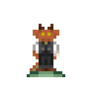

Figurine Guidelines
===================

In Moffstation, players are able to create a figurine for their characters. These figurines can be spawned randomly, and by opening moff figurine packs.

You can ask around on the discord if you would like someone to make your figurine for you.

### Generally they are designed like this:
- **Your figurine name.** Written from the perspective of someone who doesn't know your character (e.g. "Slime Chief Engineer, Green Lizard Bartender, Tall Janitor")

- **Your figurine description.** Again, written from the perspective of someone who doesn't know your character. Should start with "A figurine depicting..."

- **Your figurine voice lines.** Anywhere from 3-5 iconic or common statements. Mute chars can also just use the mime voice set.

- **A sprite with of approximately the same size.** Usually, we want all figurines to be about the same size. All texture files are 32x32, but are not completely filled out. You can use this one for reference:

## Contributing
- The voice lines for figurines go in `/Resources/Locale/en-US/_Moffstation/datasets/figurines.ftl`

- The YAML for the voice line dataset should go in `/Resources/Prototypes/_Moffstation/Datasets/figurines.yml`

- The YAML for the figurine itself should go in `/Resources/Prototypes/_Moffstation/Entities/Objects/Fun/figurines.yml`

- The textures should go in `Resources/Textures/_Moffstation/Objects/Fun/figurines.rsi`, and the `meta.json` file contained within should be updated as well

- The `id` for the figurine should be added to `MoffFigurineTable` in `/Resources/Prototypes/_Moffstation/Entities/Markers/Spawners/Random/toy.yml` 