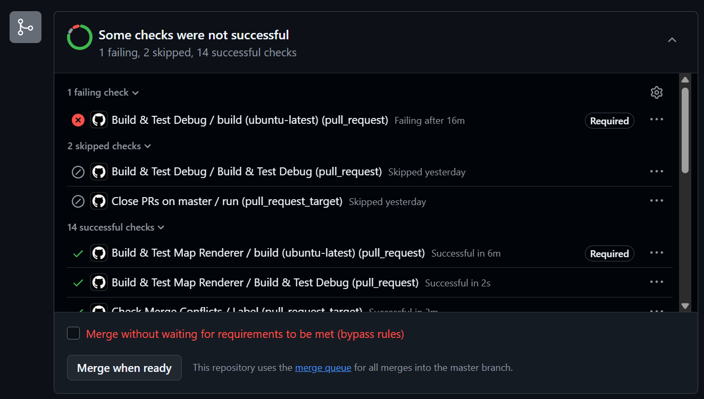
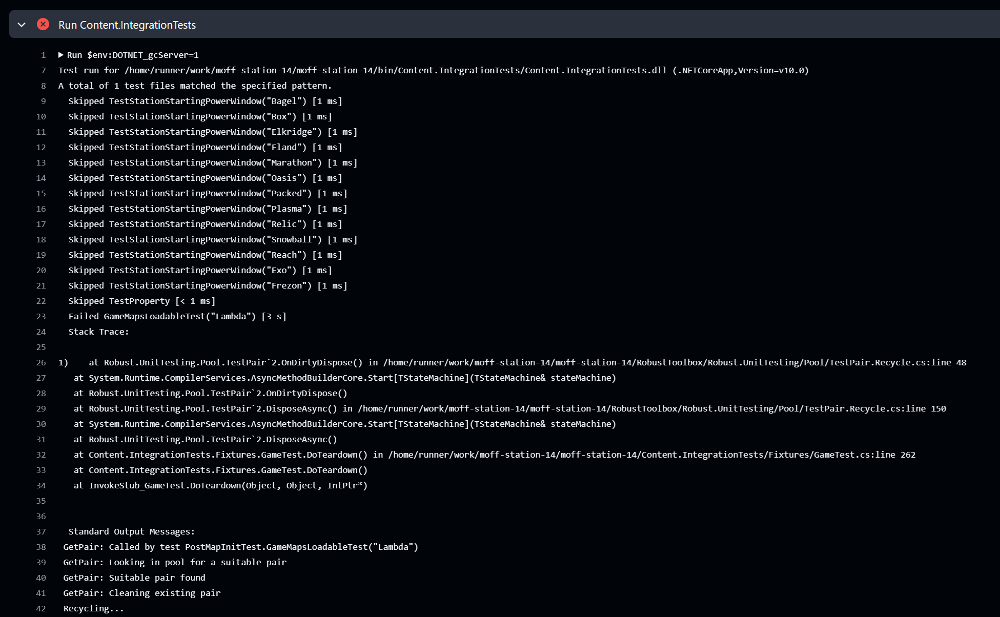
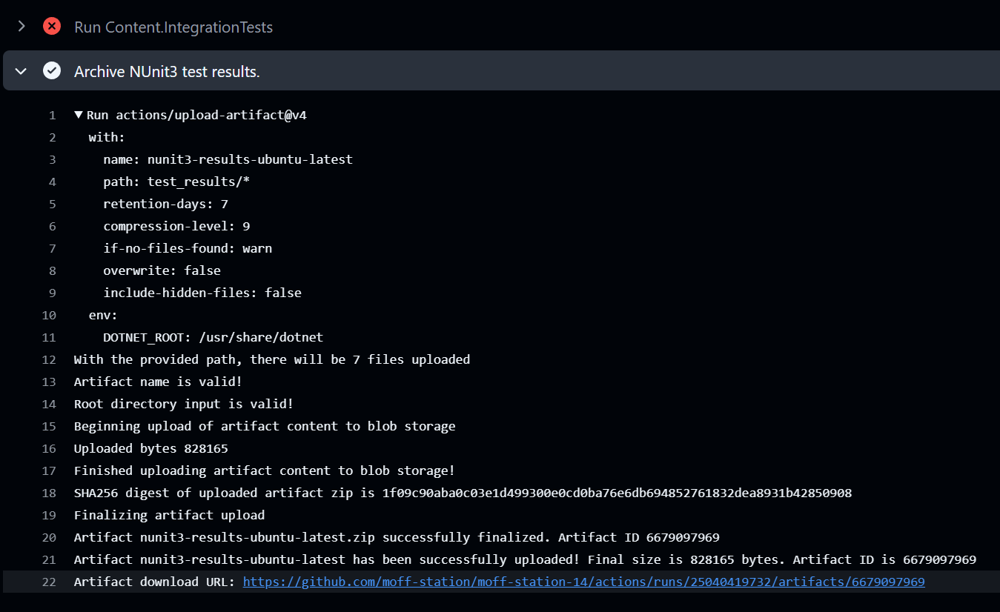
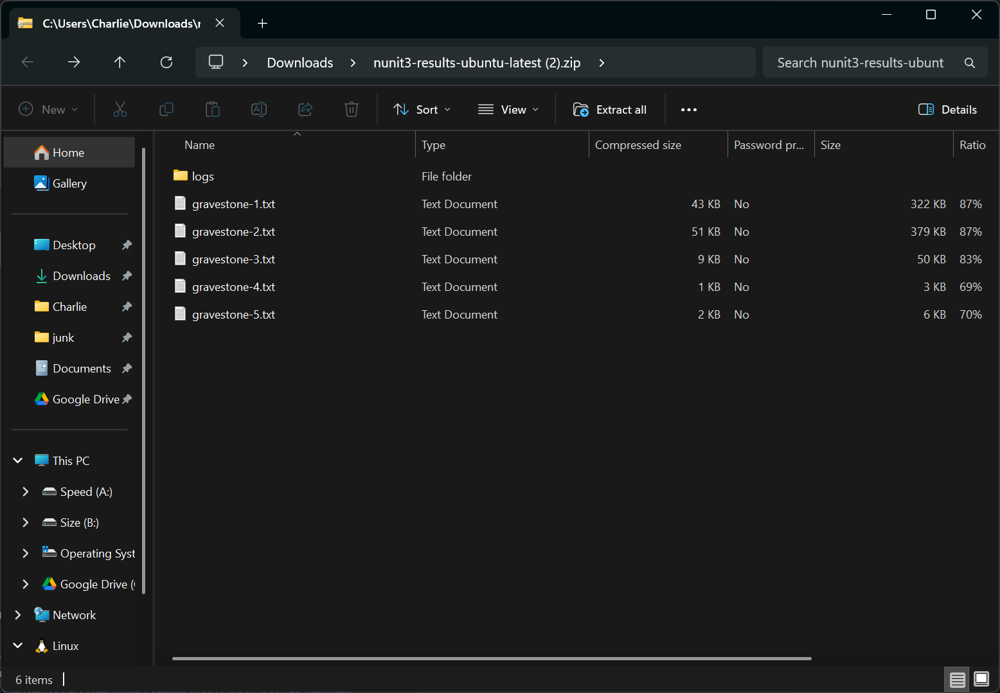
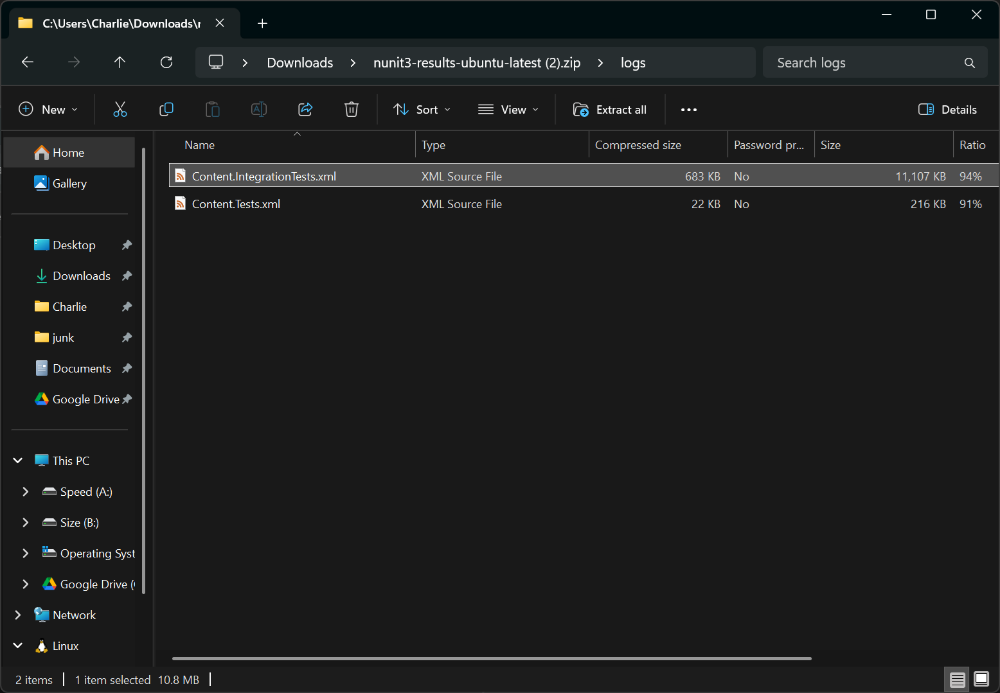
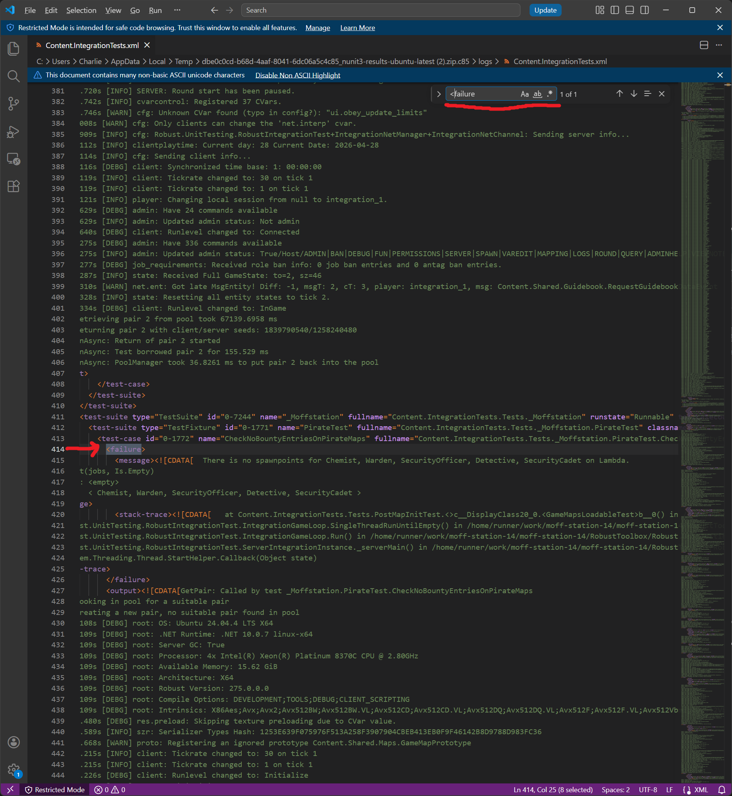

# How to get GitHub Action Test Results

## Who is this for?

If you are a contributor trying to figure out why your PR has failing checks and you can't figure out why, this guide may have the answer!

## Okay, so how do I do it?

So you made a PR and the checks failed.


You click into the failed check and you can see some check output...
but it doesn't look very helpful. It just says "a test failed lmao" and then doesn't say _why_!!


```admonish warning title="AHHHH!!"
Don't panic! It used to be that SS14 had so many tests that the output from all of them would actually cause the GHA test runner to run out
of memory, crash, and throw away all of the test output! Now, the test output is safely stored into an _archive_, we just need to find that! 
```

To get the archive, scroll past the scary red :x: to find the section `Archive NUnit3 test results`. In that section, the last line should
look like `Artifact download URL: https://github.com/moff-station/moff-station-14/actions/runs/123456789/artifacts/987654321`.
Click the link, and your browser should begin downloading the archive.



The archive is a ZIP file which contains all of the output of the unit and integration tests, so the details of the failure are _somewhere_
inside. Once it's done downloading, open it up on your system's file browser (optionally unzipping it, depending on what your file browser
is capable of) and take a look inside -- it should look something like this:



The `gravestone`s are output produced from integration testpairs describing which tests that pair ran. If you don't know what that means,
don't worry, it's not important. Navigate to `logs`. Inside, you'll see one big XML file for integration tests and another one for (unit)
tests. Depending on where the failure you're looking for was in the GHA listing at the start of the guide, you'll want to open one or the
other of these (99.9% of the time, you're going to open the integration tests results. If you broke the unit tests, you probably don't
need this guide).



Crack it open in an editor with a find tool because this thing is BIG. It's not really meant for human-consumption and is in a format that's
made to be parsed by tools to show it in a nice UI. We don't need that in this case, but it's good to know. When viewing this file, search
for the string `<failure>`. It's XML, after all, and the failure is marked-up as a failure, easy! There may be multiple, but they should
all look roughly the same:



There is a `<message>` tag nested within the failure and nested within that is a `<![CDATA[ ... ]]>` which is just a way for big wads of
text to be embedded in XML without causing issues. The message inside of it should describe the failure, as it's exactly what the test's
failure output would be were you to rerun the test through something nicer.

Congratulations! You've found the problem. Now go fix it, buddy.

## HLEP!! I didn't find it and/or I don't know how to fix this!!

That's okay! Pop on in to the Moffstation Discord and ask in `#contributing` for some help. There are some cool people there who are always
willing to lend a hand!

