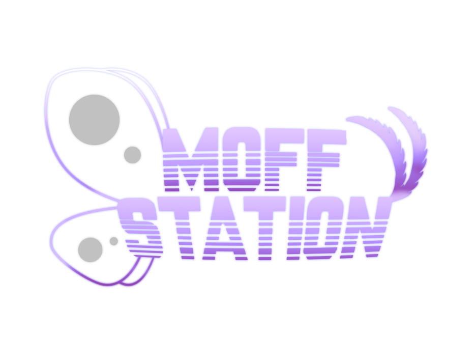

## Home

Welcome to the Moffstation Wiki! This wiki has most everything you need to know about Moffstation to get started. For more info, check the sidebar or see the [FAQ](community-info/faq.md).

This wiki is written in [Markdown](https://docs.requarks.io/en/editors/markdown) using `mdbook`. You can view our README.md for the docs site [here](https://github.com/moff-station/moff-docs/blob/master/README.md), which has useful information on `mdbook` and our plugins used.

```admonish info "Making contributions"
If you would like to make contributions to this documentation site, it's hosted fully open source on GitHub and you can make a webedit PR to any page using the button in the top right.
```
